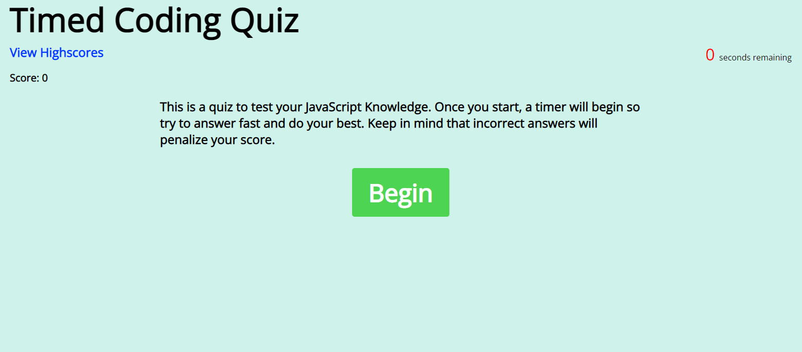

# CodeQuiz
This is a JavaScript Coding Assessment to test users on their JavaScript knowledge. This taught me about JavaScript and using the DOM to interact with HTML and CSS elements on the page and create an interactive web application.

## Getting Started
Checkout the site at https://thossain30.github.io/codequiz/

# Usage
### Here is a short preview of the website!

## License
This Project is licensed under the MIT License - see the [LICENSE.md](LICENSE.md) file for details.
